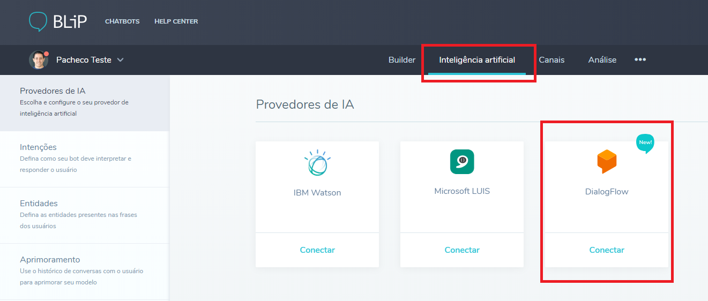
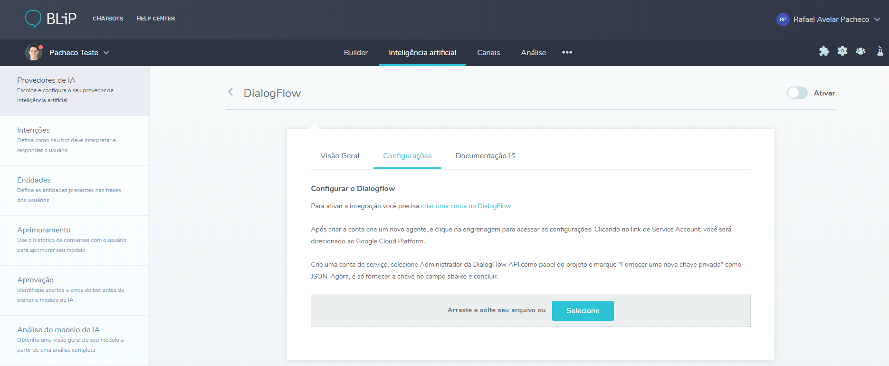
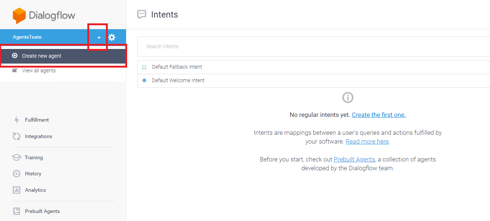
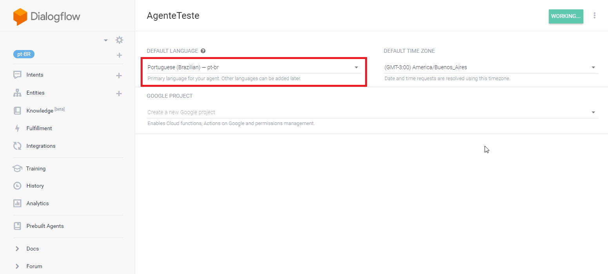
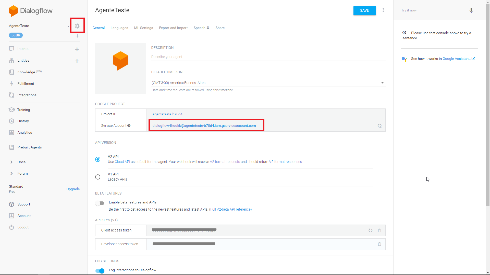
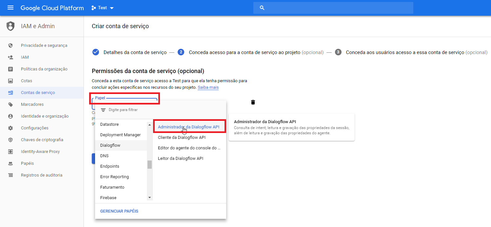
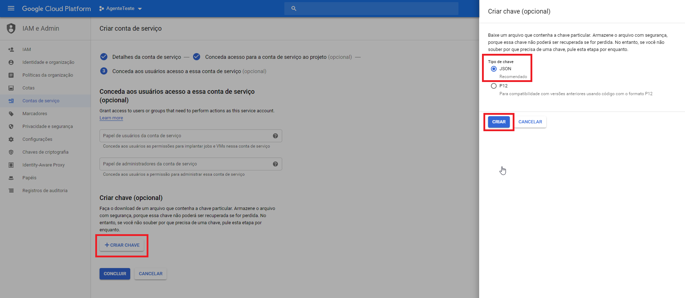
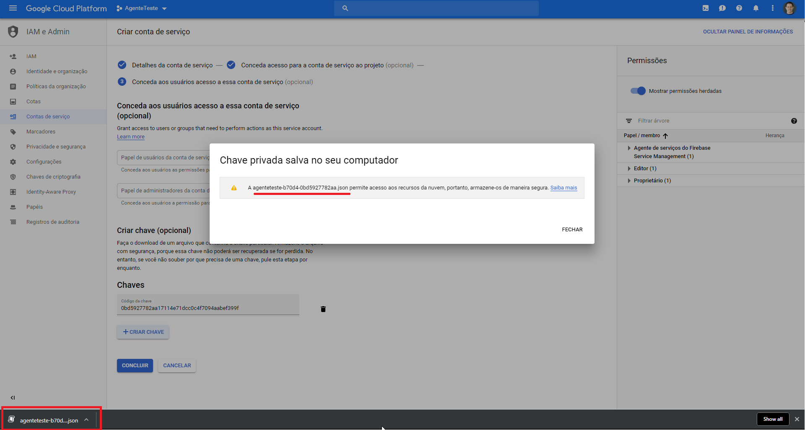
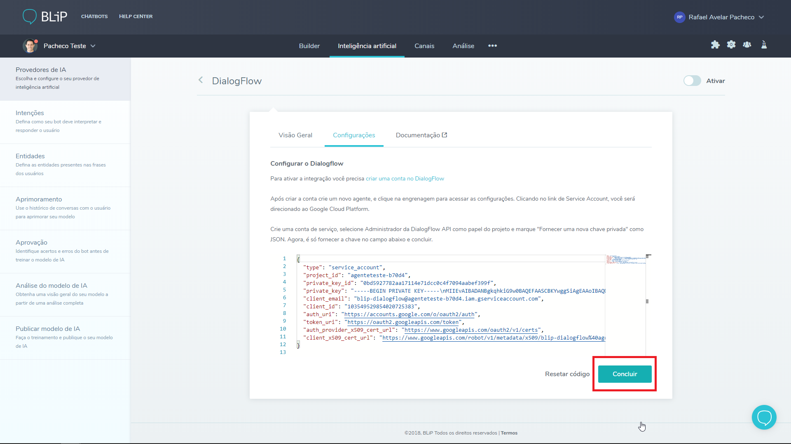

Para ativar a integração entre o BLiP e o DialogFlow (antigo api.ai) - provedor de NLP/NLU Natural Language Processing/Natural Language Understanding (do português, Processamento de linguagem natural/Entendimento de linguagem natural) do Google, são necessárias algumas configurações bem simples.

Antes de começar, certifique-se de já ter criado sua conta gratuita no DialogFlow. [Clique aqui para criar sua conta](https://console.dialogflow.com/api-client/#/login).

1) Acesse o portal do BLiP, escolha seu bot e selecione o módulo **Inteligência Artificial**.  
2) Escolha o provedor **DialogFlow**  

 

3) Após escolher o provedor DialogFlow, clique na aba **Configurações**

 

4) Abra uma nova aba no seu navegador e acesse sua conta no DialogFlow. Após realizar login, crie um Agente. Para criar um novo agente *clique no triângulo, apontado pra baixo, e depois em **Create new agent**, conforme imagem abaixo.*

 

**Obs.: Lembre-se de escolher a linguagem correta para seu agente. Para este exemplo, a escolha foi Português do Brasil.**

 

5) Clique na engrenagem para acessar as configurações de seu agente e depois clique no link **Service Account**. Você será direcionado ao Google Cloud Platform.

 

6) Crie uma conta de serviço. Este procedimento possui 3 etapas:

A) Em Detalhes da conta de serviço dê um **Nome** e uma **Descrição** para sua conta de serviço.

 

B) Na opção papel do projeto selecione **Administrador da Dialogflow API**;  

Clique em **Continuar**;

 

C) Clique em criar uma nova chave e marque a opção: "**Fornecer uma nova chave privada como JSON**".

 

Ao clicar em Criar um arquivo (no formato .JSON) será baixado para o seu computador. Guarde esse arquivo, ele será utilizado mais adiante no portal do BLiP.

Para finalizar clique em **Concluir**.

 

7) **Última etapa**: Volte ao portal do BLiP e faça upload do arquivo de chave **.JSON**

 

Após realizar o upload do arquivo clique em **Concluir**;

 
