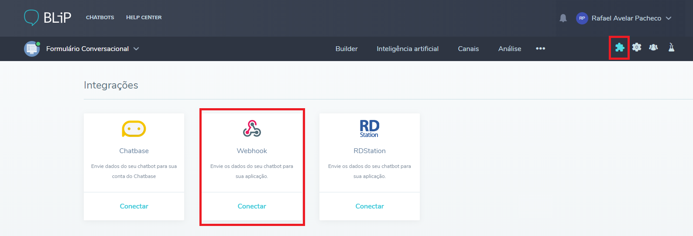
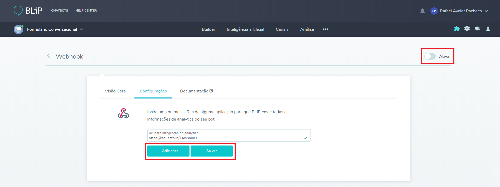

Para enviar os dados gerados em um bot para outras ferramentas, em tempo real, é possível configurar Webhooks no BLiP. Dessa forma, sempre que uma informação (mensagens ou eventos) é trafegado na plataforma ela é disparada também para todas as URLs de Webhook definidas pelo seu bot no BLiP.

## Adicionando um Webhook

Acesse o portal do BLiP, selecione seu bot e escolha o módulo **Integrações**. Escolha a opção Webhook e adicione pelo menos uma URL que receberá todas as informações enviadas pelo BLiP. Caso sejam adicionadas mais de uma URL, todas receberão as mesmas informações.

<br>

**Exemplo:**

Imagine que a aplicação responsável por receber as informações enviadas pelo BLiP está disponível na URL <https://requestb.in/14rxsmm1>. Adicione a URL no portal do BLiP, clique no botão **Salvar** e depois clique na chave **Ativar** conforme indicado na figura abaixo. Caso seja necessário adicionar uma nova URL, clique no botão **Adicionar**.

<br>

Observação: Essa URL deve estar preparada para receber requisições **HTTP** do método **POST** com objetos do tipo JSON no body da requisições. Os objetos recebidos pela aplicação definida no Webhook seguem as definições dos documentos **Message** e **Events**.

**Exemplo** de requisição realizada pelo BLiP (na aplicação configurada) quando o chatbot recebe uma mensagem de um usuário no canal Facebook.

```http
HTTP/1.1 200 OK
Content-Type: application/json
{
    "id": "65603604-fe19-479c-c885-3195b196fe8e",
    "from": "182310923192@messenger.gw.msging.net",
    "to": "mychatbot@msging.net",
    "type": "text/plain",
    "content": "Hello World!"
}
```
